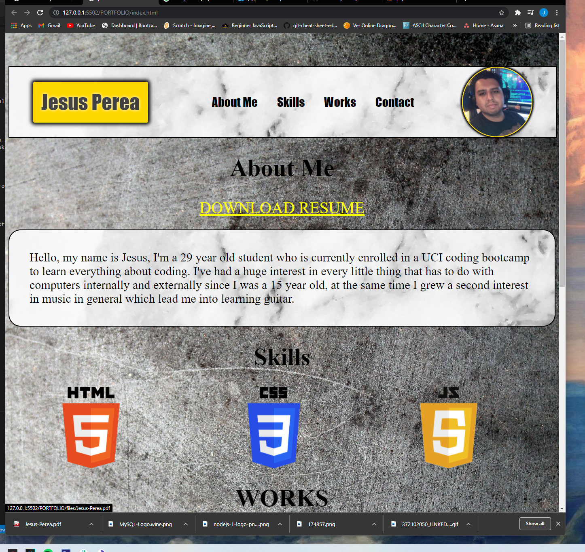
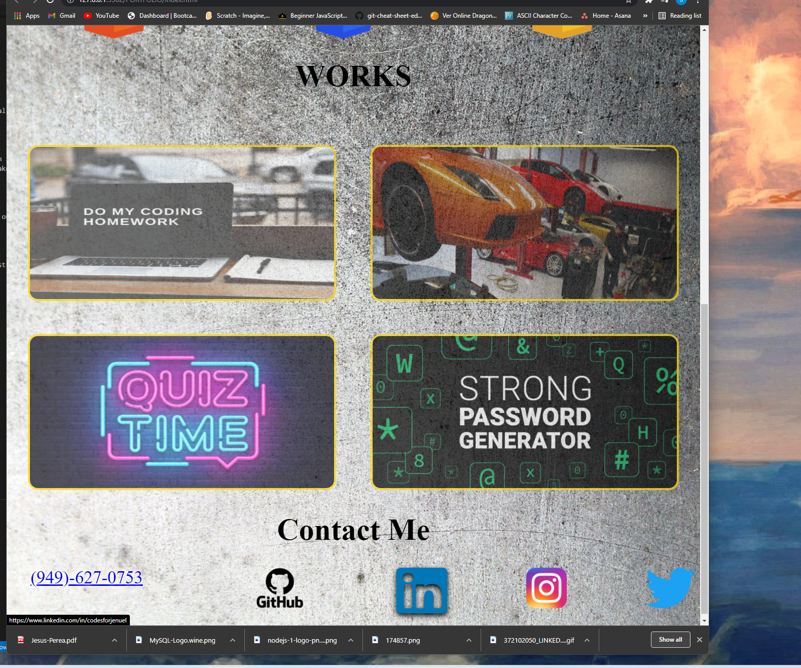

# PORTFOLIO

### BODY

I used an image of a concrete wall to give a more interesting background that would
blend in nicely with color combination of the webpage.

### HEADER

I added a marbel background to give a more luxury look to the header. A gold
color background was used on the header div that includes my name to combine 
with the marbel background on the header because, gold is a common color 
choosen to go with marbel walls or tile on buildings and houses. My photo was given a 100% radius border to give a round look which looks more professional and it's used the same way in popular websites like twitter and instagram.

### TITLES & PARAGRAPH

title sections were given a black font color with a bottom border to give the user accurate information on where the information is located, first seccion is followed by a paragraph with marbel background and round corners to make it easy and give it confort to the human eye, also the white marbel background makes the black on the font stand out.

### WORKS

The work images were inputed with an opacity background to give it a faded painting on the concrete look so when the user hovers over the image it stands out with full color and with a box shadow to give a 3d feel.

### FOOTER

The footer contains phoen number and links to social media accounts, easy to find do to the transparent background png images used for the icons, with just a click you will be directed to the websites.

### MOBILE

The webpage is adjusted to be viewed on the user's mobile screen so the font
is more readable and content is aligned for a better experience to the user.

### SCREENSHOT

Here is 2 images of my working application.

### REPOSITORY LINK

here is the link of my repository 

https://codesforjenuel.github.io/PORTFOLIO/